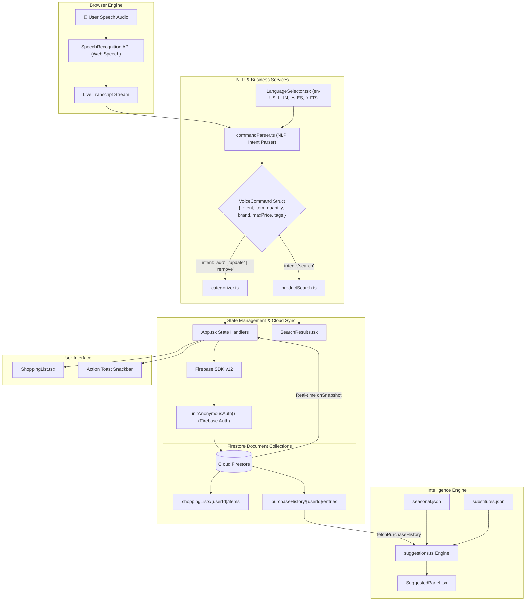

# Architecture & System Design 📐

This document details the architectural layout, data flow, component dependencies, and storage schemas for the **Voice Shopping Assistant** web application.

---

## 🔄 End-to-End System Architecture

The diagram below illustrates how user speech audio flows from the browser's Web Speech engine through the NLP command parser, state handlers, Cloud Firestore backend, and React UI components:



---

## 🧩 Core Subsystem Breakdown

### 1. Voice Recognition Subsystem ([`src/hooks/useVoiceRecognition.ts`](file:///c:/Users/Lenovo/Downloads/Voice%20Commanding/src/hooks/useVoiceRecognition.ts))
- **Role**: Interfaces directly with the browser's `SpeechRecognition` or `webkitSpeechRecognition` engine.
- **State Managed**: `isListening`, `transcript`, `interimTranscript`, `error`, and `isSupported`.
- **Error Mapping**: Converts native speech recognition events (`not-allowed`, `no-speech`, `audio-capture`, `network`) into user-friendly diagnostic messages.

### 2. Natural Language Command Parser ([`src/services/commandParser.ts`](file:///c:/Users/Lenovo/Downloads/Voice%20Commanding/src/services/commandParser.ts))
- **Role**: Transforms raw transcript strings into a structured `VoiceCommand` object:
  ```typescript
  export interface VoiceCommand {
    intent: 'add' | 'remove' | 'search' | 'update' | 'unknown';
    item: string;
    quantity?: number;
    brand?: string;
    maxPrice?: number;
    minPrice?: number;
    tags?: string[];
    originalText: string;
    language: SupportedLanguage;
  }
  ```
- **Multilingual Intent Keyword Map** ([`src/services/i18n/commandKeywords.ts`](file:///c:/Users/Lenovo/Downloads/Voice%20Commanding/src/services/i18n/commandKeywords.ts)): Matches intent keywords across English, Hindi, Spanish, and French dictionaries.
- **Entity Extraction**:
  - Quantity extraction via digits (`2`, `5`) and word forms (*one*, *two*, *dozen*, *bottle*, *pack*).
  - Price constraints (e.g. *"under $5"* ➔ `maxPrice: 5`).
  - Known brand detection (*Colgate*, *Sensodyne*, *Crest*, *Tom's*, *Organic Valley*, etc.).
  - Quality tags (*organic*, *fresh*).

### 3. Product Categorizer ([`src/services/categorizer.ts`](file:///c:/Users/Lenovo/Downloads/Voice%20Commanding/src/services/categorizer.ts))
- Maps item names into 7 distinct shopping categories (*Dairy*, *Produce*, *Bakery*, *Snacks*, *Beverages*, *Household*, *Other*) using keyword matching.

### 4. Intelligent Suggestions Engine ([`src/services/suggestions.ts`](file:///c:/Users/Lenovo/Downloads/Voice%20Commanding/src/services/suggestions.ts))
Combines three distinct recommendation sources into a single ranked list:
1. **Real Purchase History**: Reads `purchaseHistory/{userId}/entries` to detect items previously bought or removed (*"You're running low on X"*).
2. **Seasonal Recommendations**: Reads `src/data/seasonal.json` based on the current calendar month.
3. **Product Substitutes**: Reads `src/data/substitutes.json` to present alternative product chips (e.g. Milk ➔ Almond Milk).

### 5. Product Search Engine ([`src/services/productSearch.ts`](file:///c:/Users/Lenovo/Downloads/Voice%20Commanding/src/services/productSearch.ts))
Filters a 30-item product catalog dataset ([`src/data/products.json`](file:///c:/Users/Lenovo/Downloads/Voice%20Commanding/src/data/products.json)) against parsed query constraints (`item`, `brand`, `maxPrice`, `minPrice`, `tags`).

---

## 🗄️ Firestore Database Schemas

### Collection 1: `shoppingLists/{userId}/items`
Document ID: Unique item ID (string).

```json
{
  "id": "17875122828190330",
  "name": "whole milk",
  "quantity": 2,
  "category": "Dairy",
  "addedAt": "2026-08-23T19:11:22.819Z",
  "purchased": false
}
```

### Collection 2: `purchaseHistory/{userId}/entries`
Document ID: Unique log entry ID (string).

```json
{
  "id": "hist_17875122828207120",
  "itemName": "Organic Almond Milk",
  "category": "Beverages",
  "action": "purchased",
  "timestamp": "2026-08-23T19:11:22.820Z"
}
```

---

## 🌐 Offline Resilience & Caching Lifecycle

1. **Anonymous Auth Persistence**: `signInAnonymously(auth)` maintains a stable `user.uid` per browser instance. If offline or using placeholder API keys, `initAnonymousAuth()` safely falls back to local session caching (`anon_local_user_session_101`).
2. **IndexedDB Offline Persistence**: Firestore offline caching (`enableIndexedDbPersistence`) is enabled on app startup. All document writes (`setDoc`, `deleteDoc`) execute against local cache instantly and sync automatically to Cloud Firestore when network connection is restored.
3. **User-Visible Offline State**: `App.tsx` listens for `window.onLine` / `window.offLine` events to render an amber status banner (*"Offline mode — changes are saved locally and will sync when reconnected"*).
